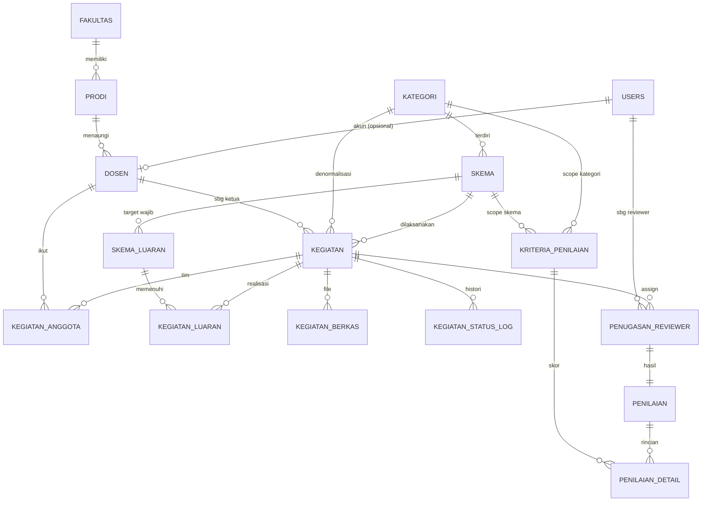

# ERD Sistem Monev P3KM

## 1. Daftar Entitas (Tabel)

| # | Tabel | Fungsi |
|---|---|---|
| 1 | `users` | Akun login (admin, reviewer, dosen) |
| 2 | `fakultas` | Master fakultas |
| 3 | `prodi` | Master program studi (milik fakultas) |
| 4 | `dosen` | Profil dosen (ketua/anggota kegiatan) — terhubung opsional ke `users` |
| 5 | `kategori` | Penelitian / Pengabdian Masyarakat |
| 6 | `skema` | Skema dalam kategori (dana max, jadwal monev) |
| 7 | `skema_luaran` | Target luaran wajib per skema (publikasi/HKI/produk/dll) |
| 8 | `kegiatan` | Inti — kegiatan yang dimonev |
| 9 | `kegiatan_anggota` | Anggota tim kegiatan (selain ketua) |
| 10 | `kegiatan_luaran` | Realisasi luaran per kegiatan |
| 11 | `kegiatan_berkas` | File laporan kemajuan/akhir/bukti |
| 12 | `kegiatan_status_log` | Histori perpindahan status kegiatan |
| 13 | `penugasan_reviewer` | Assign reviewer ke kegiatan (M:N) |
| 14 | `kriteria_penilaian` | Master kriteria + bobot (bisa per kategori/skema) |
| 15 | `penilaian` | Header penilaian (1 reviewer × 1 kegiatan) |
| 16 | `penilaian_detail` | Skor per kriteria dari satu penilaian |

---

## 2. Skema Kolom (ringkas)

### `users`
- `id` PK
- `nama`
- `email` unique
- `password_hash`
- `role` ENUM(`admin`, `reviewer`, `dosen`)
- `aktif` boolean
- `created_at`, `updated_at`

### `fakultas`
- `id` PK
- `nama` unique

### `prodi`
- `id` PK
- `fakultas_id` FK → `fakultas.id`
- `nama`

### `dosen`
- `id` PK
- `user_id` FK → `users.id` (nullable — dosen bisa ada tanpa akun login, Model A)
- `nidn` unique
- `nama`
- `prodi_id` FK → `prodi.id`
- `email`, `no_hp`

### `kategori`
- `id` PK
- `kode` ENUM(`PENELITIAN`, `PENGMAS`)
- `nama`

### `skema`
- `id` PK
- `kategori_id` FK → `kategori.id`
- `kode` (mis. `PDP`, `PKM`)
- `nama` (mis. "Penelitian Dosen Pemula")
- `dana_maksimal` decimal
- `durasi_bulan` int
- `deskripsi` text
- `aktif` boolean

### `skema_luaran`
Target luaran wajib bawaan skema.
- `id` PK
- `skema_id` FK → `skema.id`
- `jenis` ENUM(`PUBLIKASI`, `HKI`, `PRODUK`, `LAPORAN`, `LAINNYA`)
- `deskripsi`
- `wajib` boolean
- `jumlah_minimal` int

### `kegiatan`
- `id` PK
- `judul`
- `skema_id` FK → `skema.id`
- `kategori_id` FK → `kategori.id` (denormalisasi untuk kemudahan filter)
- `tahun` int
- `ketua_dosen_id` FK → `dosen.id`
- `sumber_dana` (mis. "Internal LPPM", "Hibah Kemdikbud")
- `jumlah_dana` decimal
- `tanggal_mulai`, `tanggal_selesai`
- `status` ENUM(`TERDAFTAR`, `BERJALAN`, `LAPORAN_MASUK`, `DINILAI`, `SELESAI`)
- `skor_final` decimal (nullable — auto-fill: rata-rata `penilaian.skor_akhir` semua reviewer FINAL)
- `rekomendasi_final` ENUM(`LANJUT`, `PERBAIKAN`, `DIHENTIKAN`) (nullable — modus/mayoritas rekomendasi reviewer)
- `catatan_admin` text
- `created_by` FK → `users.id`
- `created_at`, `updated_at`

### `kegiatan_anggota`
- `id` PK
- `kegiatan_id` FK → `kegiatan.id`
- `dosen_id` FK → `dosen.id`
- `peran` (mis. "Anggota 1", "Mahasiswa")

### `kegiatan_luaran`
Realisasi luaran yang dilaporkan ketua kegiatan.
- `id` PK
- `kegiatan_id` FK → `kegiatan.id`
- `skema_luaran_id` FK → `skema_luaran.id` (nullable — bisa luaran tambahan di luar target)
- `jenis` ENUM(sama spt skema_luaran.jenis)
- `judul_luaran`
- `url_bukti` / `file_id` FK → `kegiatan_berkas.id` (nullable)
- `status_capaian` ENUM(`RENCANA`, `PROSES`, `TERCAPAI`)
- `keterangan`

### `kegiatan_berkas`
- `id` PK
- `kegiatan_id` FK → `kegiatan.id`
- `jenis` ENUM(`LAPORAN_KEMAJUAN`, `LAPORAN_AKHIR`, `BUKTI_LUARAN`, `LAMPIRAN`)
- `nama_file`
- `path`
- `ukuran_byte`
- `uploaded_by` FK → `users.id`
- `uploaded_at`

### `kegiatan_status_log`
- `id` PK
- `kegiatan_id` FK → `kegiatan.id`
- `status_lama`, `status_baru` ENUM
- `oleh_user_id` FK → `users.id`
- `catatan`
- `created_at`

### `penugasan_reviewer`
Tabel pivot kegiatan ↔ reviewer.
- `id` PK
- `kegiatan_id` FK → `kegiatan.id`
- `reviewer_user_id` FK → `users.id` (role harus `reviewer`)
- `assigned_by` FK → `users.id`
- `assigned_at`
- `status` ENUM(`MENUNGGU`, `DALAM_PENILAIAN`, `SELESAI`)
- **Unique:** (`kegiatan_id`, `reviewer_user_id`)

### `kriteria_penilaian`
- `id` PK
- `scope` ENUM(`GLOBAL`, `KATEGORI`, `SKEMA`)
- `kategori_id` FK → `kategori.id` (nullable, dipakai jika scope=KATEGORI)
- `skema_id` FK → `skema.id` (nullable, dipakai jika scope=SKEMA)
- `nama` (mis. "Capaian luaran")
- `bobot` decimal (persen; total bobot per scope = 100)
- `skor_min`, `skor_max` int (mis. 1–100)
- `urutan` int
- `aktif` boolean

### `penilaian`
Header — 1 reviewer menilai 1 kegiatan satu kali (revisi diizinkan dengan versi).
- `id` PK
- `penugasan_id` FK → `penugasan_reviewer.id` (unique)
- `skor_akhir` decimal (auto: Σ skor×bobot)
- `rekomendasi` ENUM(`LANJUT`, `PERBAIKAN`, `DIHENTIKAN`)
- `catatan` text
- `status` ENUM(`DRAFT`, `FINAL`)
- `dinilai_at`
- `created_at`, `updated_at`

### `penilaian_detail`
- `id` PK
- `penilaian_id` FK → `penilaian.id`
- `kriteria_id` FK → `kriteria_penilaian.id`
- `skor` decimal
- `catatan` text (nullable)
- **Unique:** (`penilaian_id`, `kriteria_id`)

---

## 3. Relasi & Kardinalitas

```
fakultas (1) ─────< (N) prodi
prodi    (1) ─────< (N) dosen
users    (1) ──── (0..1) dosen                 [opsional, Model B]

kategori (1) ─────< (N) skema
skema    (1) ─────< (N) skema_luaran
skema    (1) ─────< (N) kegiatan
kategori (1) ─────< (N) kegiatan                [denormalisasi via skema]

dosen    (1) ─────< (N) kegiatan                [sbg ketua]
kegiatan (1) ─────< (N) kegiatan_anggota >───── (N) dosen
kegiatan (1) ─────< (N) kegiatan_luaran
skema_luaran (1) ─< (N) kegiatan_luaran         [opsional]
kegiatan (1) ─────< (N) kegiatan_berkas
kegiatan (1) ─────< (N) kegiatan_status_log

kegiatan (1) ─────< (N) penugasan_reviewer >─── (N) users [role=reviewer]

penugasan_reviewer (1) ──── (1) penilaian
penilaian (1) ─────< (N) penilaian_detail >──── (1) kriteria_penilaian

kategori (1) ─────< (N) kriteria_penilaian       [scope=KATEGORI]
skema    (1) ─────< (N) kriteria_penilaian       [scope=SKEMA]
```

**Kardinalitas penting:**
- 1 **kegiatan** → banyak **reviewer** (M:N via `penugasan_reviewer`).
- 1 **penugasan** → tepat 1 **penilaian** (header). Revisi disimpan sebagai update; satu reviewer tidak bisa punya 2 penilaian aktif untuk kegiatan yang sama.
- 1 **penilaian** → banyak **penilaian_detail** (satu baris per kriteria aktif saat penilaian dibuat).
- 1 **skema** → banyak **kriteria_penilaian** (jika skema punya kriteria spesifik), jika tidak → pakai scope `KATEGORI` atau `GLOBAL`.
- `kegiatan.skor_final` = AVG semua `penilaian.skor_akhir` yang FINAL → otomatis ter-update setiap reviewer finalisasi penilaian.

---

## 4. Diagram (Mermaid)



---

## 5. Aturan Integritas (rules of the database)

1. **Status kegiatan** hanya boleh maju sesuai alur (TERDAFTAR → BERJALAN → LAPORAN_MASUK → DINILAI → SELESAI). Mundur hanya boleh oleh admin + tercatat di `kegiatan_status_log`.
2. **Penilaian** boleh dibuat hanya jika `kegiatan.status` ≥ `LAPORAN_MASUK` dan reviewer sudah ter-assign.
3. **Total bobot** `kriteria_penilaian` aktif untuk satu scope efektif (skema/kategori/global) harus = 100. Validasi di aplikasi.
4. **`skor_akhir`** di `penilaian` diisi otomatis = `Σ(detail.skor × kriteria.bobot/100)` saat status berubah ke FINAL.
5. **`skor_final`** di `kegiatan` dihitung otomatis = `AVG(penilaian.skor_akhir)` dari semua reviewer yang statusnya FINAL. Di-trigger ulang setiap ada penilaian baru yang di-finalisasi.
6. **`rekomendasi_final`** diisi berdasarkan **modus** rekomendasi reviewer (mayoritas). Jika seri (mis. 1 LANJUT vs 1 DIHENTIKAN), default ke yang lebih konservatif (PERBAIKAN/DIHENTIKAN). Admin tetap bisa override manual.
5. **Reviewer hanya melihat** kegiatan via JOIN ke `penugasan_reviewer.reviewer_user_id = current_user`.
6. **Ketua dosen** tidak boleh sekaligus jadi reviewer kegiatan yang sama (validasi aplikasi).
7. **Kategori di `kegiatan`** wajib sama dengan `skema.kategori_id` (constraint check / trigger).
8. **Soft delete** untuk `skema`, `kriteria_penilaian`, `kegiatan` (kolom `aktif`/`deleted_at`) — jangan hard delete karena terikat histori penilaian.

---

## 6. Indeks yang Direkomendasikan

- `kegiatan(status, tahun)` — dashboard count per status.
- `kegiatan(skema_id, tahun)` — rekap per skema.
- `kegiatan(ketua_dosen_id)` — list "kegiatan saya".
- `penugasan_reviewer(reviewer_user_id, status)` — list tugas reviewer.
- `penilaian_detail(penilaian_id)` — render borang.
- `kegiatan_berkas(kegiatan_id, jenis)` — ambil laporan terbaru.
